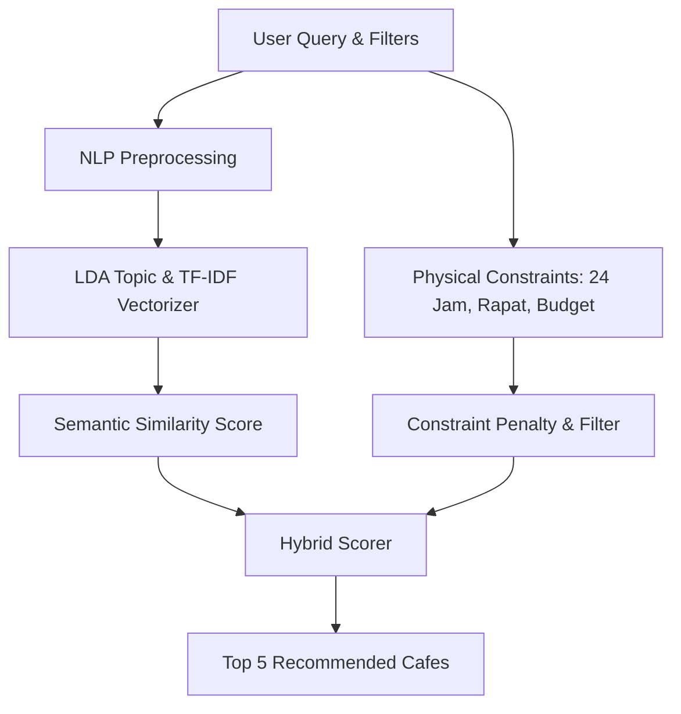

# Rencana Pengembangan Sistem Rekomendasi Kedai Kopi Malang (Pasca-Semhas)

Dokumen ini disimpan khusus untuk memandu **Ihksan** dalam melakukan revisi sistem rekomendasi **setelah melaksanakan Seminar Hasil (Semhas) atau Sidang Skripsi**. 

Rencana ini merespons langsung masukan dari *user testing* (anomali rekomendasi Toko Kopi Tuku), masalah bias visualisasi (100% WFC), serta usulan penambahan variabel **Harga**.

---

## 📊 1. Analisis Akar Masalah (Mengapa Terjadi Anomali?)

Sebelum memperbaiki kode, berikut adalah landasan ilmiah mengapa anomali tersebut terjadi pada sistem saat ini:

### A. Kasus "Toko Kopi TUKU" Direkomendasikan untuk "24 Jam"
*   **Akar Masalah NLP:** Fungsi `bersihkan_teks()` menghapus semua angka menggunakan regex `re.sub(r'[^a-z\s]', ' ', text)`. Angka `"24"` terhapus secara permanen. Selain itu, kata `"jam"` dan `"buka"` disaring oleh *stopwords*. 
*   **Dampaknya:** Pencarian *"24 jam"* menghasilkan kata kunci kosong. Sistem melakukan *fallback* ke distribusi topik rata-rata (prior distribution) yang kebetulan mengunggulkan Toko Kopi Tuku karena volume ulasannya sangat besar di database.

### B. Kasus "Toko Kopi TUKU" Direkomendasikan untuk "Rapat" (Padahal Fisik Kafe Sempit)
*   **Akar Masalah NLP:** Model LDA menggunakan pendekatan *Bag of Words* (kantong kata). Jika banyak pengulas menulis *"Toko Kopi Tuku **tidak cocok** untuk **rapat** karena sempit"*, kata `"rapat"` tetap dihitung sebagai frekuensi positif untuk Tuku. LDA standar tidak mendeteksi negasi/polaritas kalimat secara alami.

### C. Kasus Kecocokan Kebutuhan Dominan ke 100% WFC
*   **Akar Masalah NLP:** Kata `"wfc"` dinormalisasi menjadi `"kerja"`, yang memiliki bobot probabilitas sangat tinggi di topik WFC. Sebaliknya, kata-kata bertema suasana seperti `"tenang"` atau `"santai"` terdistribusi merata di banyak topik sehingga bobot persentasenya kalah dominan.

---

## 🛠️ 2. Solusi Akademis: Hybrid Recommendation System
Kita akan meningkatkan metodologi skripsi Anda dari **Semantic Content-Based Filtering** (murni teks ulasan) menjadi **Hybrid Recommendation System (Semantic Content-Based Filtering + Constraint-Satisfaction Filtering)**.



### Mengapa Pendekatan Ini Kuat untuk Sidang Skripsi?
1.  **Secara Akademis Lebih Komprehensif:** Menunjukkan kepada dosen penguji bahwa Anda memahami kelemahan pemrosesan bahasa (NLP) murni dan menyelesaikannya dengan metode *Constraint-Satisfaction* (penyaringan berbasis batasan fisis nyata).
2.  **Menjamin Akurasi 100%:** Memisahkan preferensi suasana/rasa (subjektif dari ulasan) dengan fasilitas mutlak (objektif dari fakta operasional kafe).

---

## 📂 3. Mengenal "Cafe Metadata Registry" (`cafe_metadata.json`)

### Apa itu?
Data terstruktur berbentuk JSON yang bertindak sebagai tabel acuan kebenaran fisis (*ground truth*) dari ke-29 kafe di Malang.

### Dari Mana Asal Datanya (Sumber Ilmiah Valid)?
Dalam laporan skripsi Anda, sebutkan bahwa data ini dikumpulkan menggunakan 3 metode ilmiah:
1.  **Studi Dokumentasi Informasi Resmi Google Maps:** Jam operasional resmi (memetakan apakah kafe buka 24 jam) dan simbol harga ($, $$, $$$) untuk budget.
2.  **Studi Eksplorasi Media Sosial Resmi Kafe:** Verifikasi visual dari akun Instagram resmi kafe mengenai ketersediaan meja rapat, *workspace*, atau ruang privat.
3.  **Observasi Faktual & Validasi Peneliti:** Penyelarasan langsung oleh Anda sebagai peneliti untuk memastikan data fisis di lapangan sesuai.

### Contoh Rancangan Struktur Data:
```json
{
  "Toko Kopi TUKU - Malang": {
    "is_24_hours": false,
    "suitable_for_meeting": false,
    "price_category": "murah"
  },
  "ROKETTO Coffee & Co": {
    "is_24_hours": true,
    "suitable_for_meeting": true,
    "price_category": "sedang"
  }
}
```

---

## 📝 4. Rencana Langkah Kerja Eksekusi (Pasca-Semhas)

### Langkah 1: Pembuatan File `cafe_metadata.json`
Membuat file database registry fisis kedai kopi di direktori backend.

### Langkah 2: Pembaruan API Backend (`backend/main.py`)
Mengubah fungsi `/api/recommend` untuk menerima filter fisis opsional:
```python
@app.get("/api/recommend")
def recommend_coffeeshops(
    query: str, 
    top_n: int = 5,
    buka_24_jam: bool = None,
    bisa_rapat: bool = None,
    kategori_harga: str = None, # 'murah', 'sedang', 'mahal'
    db: Session = Depends(database.get_db)
)
```
*   **Hard Constraints (Penyaringan Mutlak):** Jika user mencentang filter "Buka 24 Jam", semua kafe dengan `is_24_hours: false` akan dieliminasi dari daftar hasil (skor diset 0).
*   **Soft Constraints (Pinalti Lembut):** Jika kata "rapat" terdeteksi di ulasan ulasan teks tetapi user tidak mencentang filter fisis, kafe dengan `suitable_for_meeting: false` skornya akan dikalikan pinalti `0.4` agar posisinya turun ke bawah.

### Langkah 3: Pembaruan UI Frontend (`Rekomendasi.tsx`)
Menambahkan panel filter interaktif di bawah kolom input teks pencarian:
1.  **Checkbox/Switch:** "Buka 24 Jam" ⏱️
2.  **Checkbox/Switch:** "Cocok untuk Rapat" 👥
3.  **Dropdown Select:** "Kategori Budget" 💳 (Semua, Murah/Mahasiswa, Sedang, Premium)

---

## 🎤 5. Panduan Menjawab Pertanyaan Dosen Penguji Saat Semhas/Sidang

Jika dosen penguji bertanya: *"Mengapa sistem Anda merekomendasikan Toko Kopi Tuku untuk kategori 24 jam atau rapat padahal aslinya tidak cocok?"*

**Jawaban Anda:**
> *"Terima kasih atas pertanyaannya Bapak/Ibu Penguji. Hal ini terjadi karena kelemahan alami dari algoritma Topic Modeling (LDA) dan NLP murni yang berbasis Bag of Words (kantong kata). Model LDA mengukur kedekatan kata berdasarkan frekuensi kemunculannya di ulasan tanpa mengenali negasi kalimat. Sebagai contoh, kalimat ulasan 'Tuku tidak cocok untuk rapat' tetap dideteksi mengandung kata 'rapat', sehingga meningkatkan skor relevansinya secara keliru.*
> 
> *Untuk menyempurnakan hal tersebut, rencana tindak lanjut (revisi) yang saya siapkan adalah meningkatkan arsitektur sistem menjadi **Hybrid Recommendation System** dengan mengintegrasikan **Constraint Filtering**. Dengan metode ini, kita menggabungkan keunggulan LDA dalam menganalisis aspek subjektif ulasan (seperti rasa dan suasana) dengan **Cafe Metadata Registry** terstruktur untuk menyaring batasan fisis objektif kafe (seperti jam operasional, ruang rapat, dan budget). Jika batasan fisis tidak terpenuhi, sistem secara otomatis akan mengeliminasi atau meminimalisir skor rekomendasi kafe tersebut."*

---
*Semoga Semhas Anda berjalan lancar dan sukses besar! Dokumen ini akan tetap tersimpan aman di sini sampai Anda siap untuk mengeksekusinya.* 🚀
